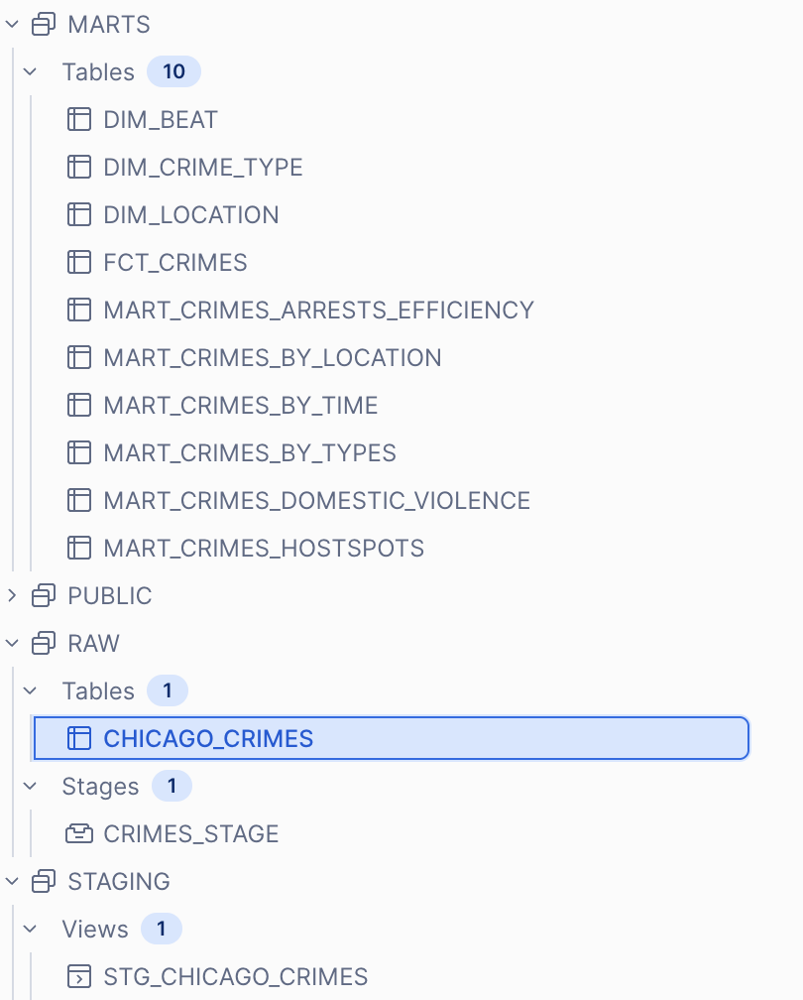

# Chicago Crimes — dbt + Snowflake

Analytics engineering project built on the [Chicago Crimes public dataset](https://data.cityofchicago.org/Public-Safety/Crimes-2001-to-Present/ijzp-q8t2) using **dbt** for transformations and **Snowflake** as the data warehouse.

## Architecture

```
Raw CSV
   └── Snowflake Internal Stage (PUT via SnowSQL)
           └── COPY INTO → RAW.chicago_crimes
                   └── dbt
                         ├── STAGING.stg_chicago_crimes  (view)
                         └── MARTS
                               ├── dim_crime_type         (table)
                               ├── dim_location           (table)
                               ├── dim_beat               (table)
                               ├── fct_crimes             (table)
                               ├── mart_crimes_by_type    (table)
                               ├── mart_crimes_by_location(table)
                               ├── mart_crimes_by_time    (table)
                               ├── mart_crimes_hotspots   (table)
                               ├── mart_domestic_violence (table)
                               └── mart_arrest_efficiency (table)
```

## Snowflake Setup

```sql
USE ROLE accountadmin;

CREATE WAREHOUSE crimenes_chicago WITH warehouse_size='x-small';
CREATE DATABASE crimenes_chicago_db;
CREATE ROLE crimenes_chicago_role;

GRANT USAGE ON WAREHOUSE crimenes_chicago TO ROLE crimenes_chicago_role;
GRANT ROLE crimenes_chicago_role TO USER <your_user>;
GRANT ALL ON DATABASE crimenes_chicago_db TO ROLE crimenes_chicago_role;

USE ROLE crimenes_chicago_role;

CREATE SCHEMA crimenes_chicago_db.raw;
CREATE SCHEMA crimenes_chicago_db.staging;
CREATE SCHEMA crimenes_chicago_db.marts;
```

**Create the raw table:**
```sql
USE DATABASE crimenes_chicago_db;

CREATE OR REPLACE TABLE raw.chicago_crimes (
    id                   NUMBER,
    case_number          VARCHAR(10),
    date                 TIMESTAMP_NTZ,
    block                VARCHAR(50),
    iucr                 VARCHAR(10),
    primary_type         VARCHAR(50),
    description          VARCHAR(100),
    location_description VARCHAR(100),
    arrest               BOOLEAN,
    domestic             BOOLEAN,
    beat                 VARCHAR(10),
    district             VARCHAR(10),
    ward                 NUMBER,
    community_area       VARCHAR(10),
    fbi_code             VARCHAR(10),
    x_coordinate         NUMBER,
    y_coordinate         NUMBER,
    year                 NUMBER(4),
    updated_on           TIMESTAMP_NTZ,
    latitude             FLOAT,
    longitude            FLOAT,
    location             VARCHAR(50)
);
```

**Load the CSV via SnowSQL:**
```sql
-- Create stage
CREATE OR REPLACE STAGE raw.crimes_stage
  FILE_FORMAT = (
    TYPE                      = 'CSV'
    FIELD_OPTIONALLY_ENCLOSED_BY = '"'
    SKIP_HEADER               = 1
    TIMESTAMP_FORMAT          = 'MM/DD/YYYY HH24:MI:SS AM'
    NULL_IF                   = ('', 'NULL')
  );

-- Upload file (run from SnowSQL CLI)
PUT file:///path/to/Crime_Chicago.csv @raw.crimes_stage;

-- Load into table
COPY INTO raw.chicago_crimes
FROM @raw.crimes_stage/Crime_Chicago.csv.gz
FILE_FORMAT = (
    TYPE                      = 'CSV'
    FIELD_OPTIONALLY_ENCLOSED_BY = '"'
    SKIP_HEADER               = 1
    TIMESTAMP_FORMAT          = 'MM/DD/YYYY HH24:MI:SS AM'
    NULL_IF                   = ('', 'NULL')
)
ON_ERROR = 'CONTINUE';
```

> `PUT` only works from **SnowSQL CLI**, not Snowsight. After upload Snowflake auto-compresses the file to `.csv.gz`.

## dbt Setup

**Install dependencies:**
```bash
pip install dbt-snowflake
dbt deps
```

**Configure `~/.dbt/profiles.yml`:**
```yaml
chicago_crimes:
  outputs:
    dev:
      type: snowflake
      account: <your_account>
      user: <your_user>
      password: <your_password>
      role: crimenes_chicago_role
      database: crimenes_chicago_db
      warehouse: crimenes_chicago
      schema: raw
      threads: 10
  target: dev
```

**Run the project:**
```bash
dbt run
dbt test
```

**Schemas**

